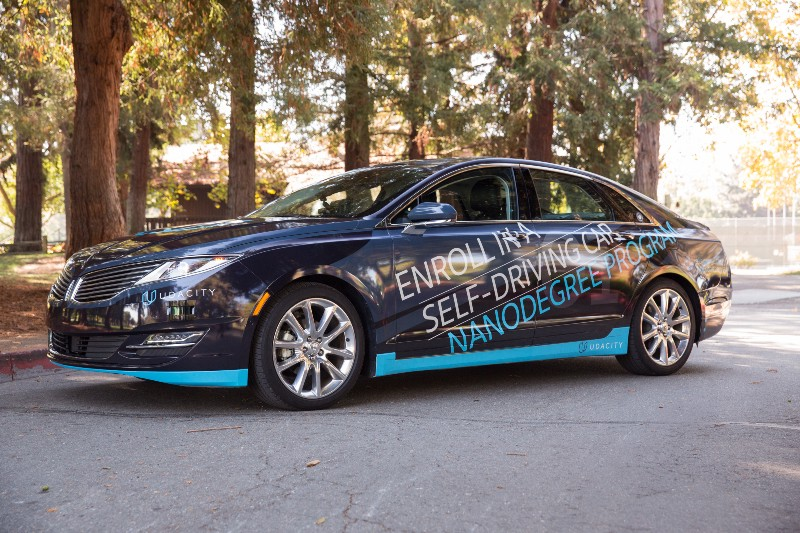
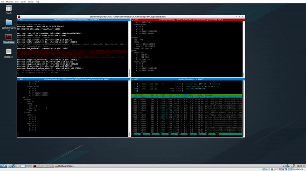

## Self-Driving Car Capstone Project - Team Dörnbach

*"Self-Driving Car Engineer Nanodegree? Dat war doch schon immer dein alter Jugendtraum!"*

This is the capstone project of [Udacity's Self-Driving Car Engineer Nanodegree](www.udacity.com/drive) in which the goal was to develop a software in a team of 5 students that runs on a real, self-driving car and is able to steer it through a test track, respecting the defined speed limit and to stop at traffic lights.

The operating system used for this task is called ROS (Robot Operating System), a very popular, modular system optimized for robotics which allows the synchronous and asynchronous communication between the single hard- and software components involved in this task such as the camera providing the image required for the traffic light detection, lidar or software services which for example provide already processed data in form of the current traffic light state or the next way points for the drive by wire system.

---

##  Team Dörnbach

*Nobody can develop a self-driving car alone and so it was really a huge pleasure to spend theses last 10 months together in Slack with this awesome team and to develop this final of the overall 14 projects with it:*

* [Michael Berner](https://github.com/thelukasssheee) - Mercedes Benz Trucks
* [Michael Ikemann](https://github.com/alyxion) - Lead Engineer @ Zühlke Engineering GmbH
* [Jakub Prüher](https://github.com/jacobnzw) - PhD candidate in cybernetics
* [Soen Surya Soenaryo](https://github.com/weisurya) - Software Engineer @ Xendit
* [Melih Yazgan](https://github.com/melihyazgan) - Engineer @ ITK Engineering GmbH

*"Self-Driving Car Engineer Nanodegree? Dat war doch schon immer dein alter Jugendtraum!"*

---

---

This repository contains the whole source code of this project and you are welcome to try it out yourself on your local machine. [Here](setup.md) you can find the detailed setup instructions to do so.
